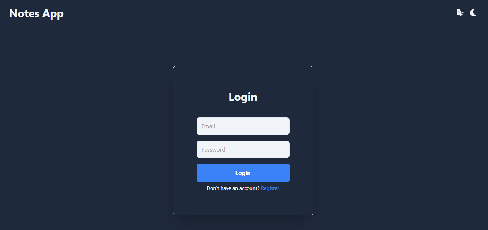
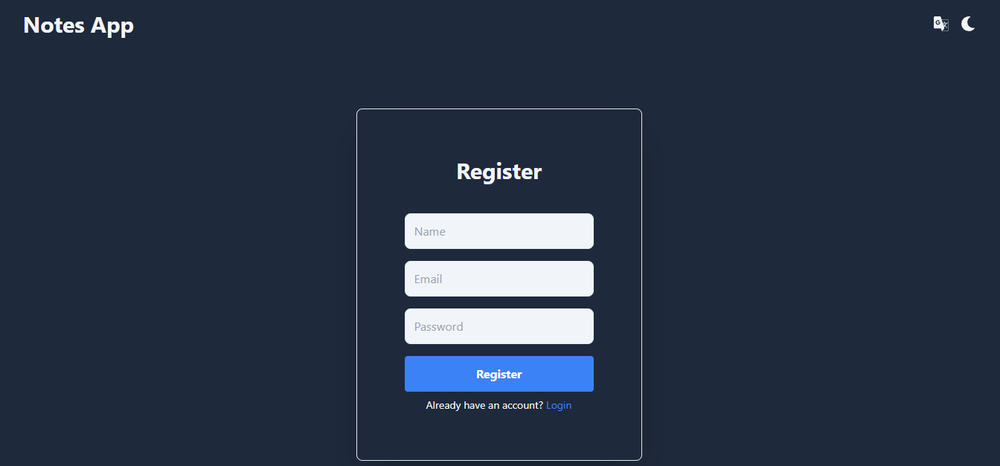
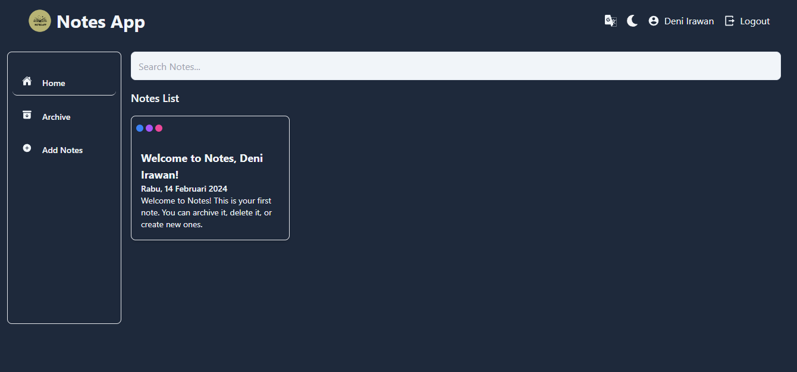
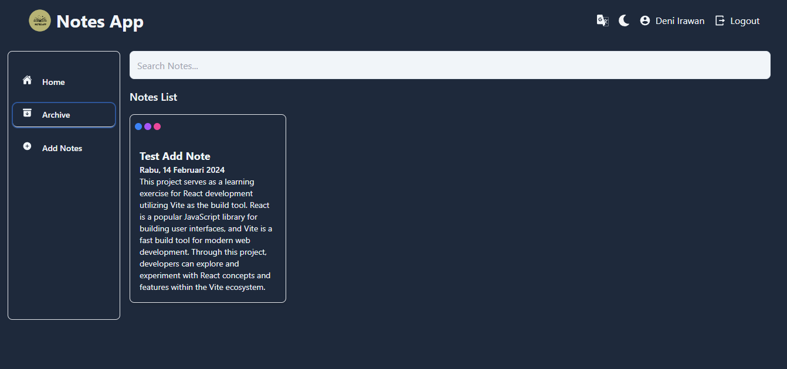
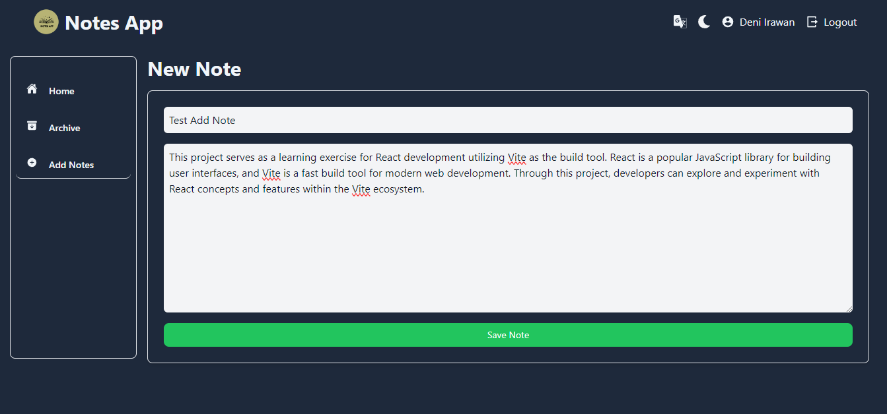
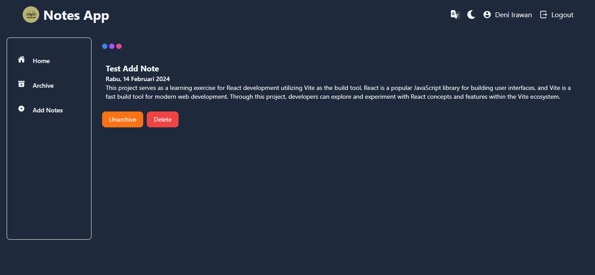

# Notes App with React

## Introduction

This is a simple notes app using API with React. It has three pages: Login, Register, Home, Archive, Detail, and Add Note. The Home page has a list of notes. The Add Note page has a form for creating a new note. The Archive page has a list of notes that have been archived. Detail page has a more detailed view of the note and button for archiving or unarchiving and deleting. The Register page has a form for creating a new account. The Login page has a form for logging in. You can see light and dark mode, anf change the language from english to indonesian and repeat.

## Libraries Used

- React
- React Router DOM
- React Icons
- Tailwind CSS
- Vite
- Prop Types

## How To Use

1. Clone the repository

   ```bash
   git clone https://github.com/densu341/react-notes-app
   ```

2. Run `npm install` in the terminal
3. Run `npm run dev` in the terminal
4. Open your browser and navigate to http://localhost:5173

## Preview The Application

### 1) Login Page



### 2) Register Page



### 3) Home Page



### 4) Archive Page



### 5) Add Note Page



### 6) Detail Page


